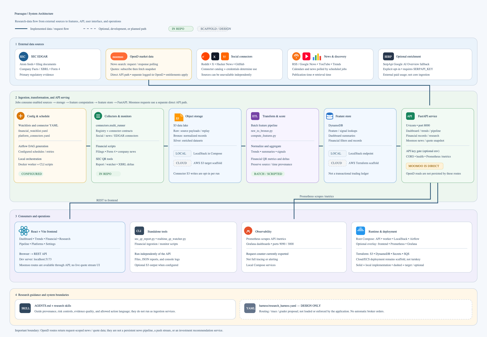

# Praesagus

Starter repo for the Praesagus market intelligence platform.

## Agent startup and replacement

See [agent operations](agent-operations/README.md), [handoff templates](agent-operations/handoffs/README.md) and [schedules](agent-operations/schedules/README.md).

- Lead: [agent-operations/startup-prompts/lead.md](agent-operations/startup-prompts/lead.md)
- Trader: [agent-operations/startup-prompts/trader.md](agent-operations/startup-prompts/trader.md)
- Engineer: [agent-operations/startup-prompts/engineer.md](agent-operations/startup-prompts/engineer.md)

Use [the spawn skill](skills/spawn/SKILL.md): `$spawn lead`, `$spawn trader`, `$spawn engineer` or `$spawn all`. `/spawn ROLE` is a natural-language alias. Single-role invocation adopts and renames the current human-started chat without creating another. For all, identify existing destination chats. Replacement summarizes verified context, reconciles schedules, then renames/archives predecessors after takeover. These instructions do not themselves create chats or migrate live schedules.

## Architecture



Editable source: [docs/praesagus-architecture.svg](docs/praesagus-architecture.svg).

The diagram separates working local paths from optional or scaffolded cloud paths, labels representative source and infrastructure services, and shows the API-only Moomoo/OpenD route. The architecture is intentionally explicit that Moomoo requests are not persisted by those routes, and the research harness YAML is a design document rather than a running service. The editable vector source is [docs/praesagus-architecture.svg](docs/praesagus-architecture.svg).

## Quick Start

### 1. Install dependencies

```bash
poetry install
```

Install Node.js separately for the frontend.

### 2. Start backend, ingestion, and local services

In terminal 1, from the repository root:

```bash
docker compose up --build
```

This starts the API, configured ingestion worker, LocalStack, Airflow, Prometheus, and Grafana. API is at `http://localhost:8000`; Airflow `:8080`; Prometheus `:9090`; Grafana `:3000`.

### 3. Start the frontend

In terminal 2:

```bash
cd frontend
npm install
npm run dev
```

Open `http://localhost:5173`. Keep both terminals running. Press `Ctrl+C` in each terminal to stop services.

### 4. Connect Moomoo OpenD (optional)

Install and start Moomoo OpenD separately, log in there, and ensure its listening port is reachable from the API container. Compose defaults the API connection to `host.docker.internal:11111`; override it when needed:

```bash
MOOMOO_OPEND_HOST=host.docker.internal MOOMOO_OPEND_PORT=11111 docker compose up --build
```

Search news (request/response polling; maximum 10 calls per 30 seconds in one API process):

```bash
curl --get 'http://localhost:8000/api/v1/moomoo/news' --data-urlencode 'keyword=AAPL' --data-urlencode 'max_count=10'
```

Fetch a latest quote snapshot (codes must include a market prefix):

```bash
curl --get 'http://localhost:8000/api/v1/moomoo/quotes' --data-urlencode 'codes=US.AAPL'
```

Both responses include `retrieved_at`. News search is not a continuous push feed, and the quote route returns a snapshot rather than streaming updates. Market-data entitlements may be required. If `PRAESAGUS_API_KEY` is configured, add `-H 'X-API-Key: YOUR_KEY'` to the requests.

For the separate private REST AppKey workflow, follow [secure macOS credential onboarding](docs/MOOMOO_CREDENTIAL_SETUP.md) and the [manual private collector](docs/PRIVATE_MARKET_COLLECTOR.md). This uses encrypted Ed25519 credentials and exact login Keychain lookup; OpenD login does not configure it. Live collection requires an explicit manual invocation and private storage.

### 5. Run SEC filing analysis or live QR monitoring

Run a one-time report with local summarization (no SerpApi key required):

```bash
poetry run python scripts/sec_qr_report.py --companies AAPL:0000320193 MSFT:0000789019 --forms 10-Q 8-K --out /tmp/sec_reports --interval 0 --summarize
```

Monitor current SEC filings continuously (default poll: 60 seconds):

```bash
poetry run python scripts/realtime_qr_watcher.py --poll-interval 60 --lookback-minutes 60
```

For the shortest path to the standalone tool menu:

```bash
poetry run python scripts/cli_tools.py
```

`--use-serpapi` is optional and requires `SERPAPI_KEY`. Social connectors such as Reddit and X also need their own credentials; connectors without credentials may log failures while other configured connectors run.

Local test of the Reddit connector:

```bash
poetry run python -m connectors.examples.reddit_connector

# Run tests
poetry run pytest -q
```

If you prefer pip, a `requirements.txt` file is included for compatibility, but Poetry is the recommended workflow.
# praesagus

A quantitative market analysis engine designed to spot institutional trading signals and predict macro trend reversals.

This repo also hosts Cursor Agent Skills for equity research workflows.

## Skills

| Skill | Path | Description |
|-------|------|-------------|
| Elite IPO & Equity Research | `skills/elite-ipo-equity-research/` | Institutional-grade equity research for Bursa Malaysia and global tech stocks/IPOs |

### elite-ipo-equity-research

Produces sell-side quality output including:

- 34-column side-by-side comparison table
- DCF methodology and scenario analysis (Bull / Base / Bear)
- Risk matrix and executive summary
- IPO Investment Score (/100)
- Final recommendation with conviction and allocation guidance
- RM1,500 retail IPO allocation strategy
- Ranked output table

**Trigger terms:** Bursa Malaysia, Malaysian IPOs, ACE/Main/LEAP listings, NASDAQ/NYSE tech stocks, cross-border equity comparisons.

## Installation

Symlink the skill into your personal Cursor skills folder so it is available across all projects:

```bash
ln -s "$(pwd)/skills/elite-ipo-equity-research" ~/.cursor/skills/elite-ipo-equity-research
```

## First-time setup

1. Install dependencies:

```bash
poetry install
```

2. Create local stack services and bootstrap the development environment:

```bash
docker-compose up --build
```

3. Verify local containers:

- Backend API: `http://localhost:8000`
- Airflow webserver: `http://localhost:8080`
- Prometheus: `http://localhost:9090`
- Grafana: `http://localhost:3000`

4. Seed local resources if needed:

```bash
poetry run python scripts/bootstrap_localstack.py
```

## Going live

For production deployment, use Terraform to provision the core infrastructure and ECS resources. Ensure the following services are configured:

- S3 buckets for raw, bronze, and silver data
- DynamoDB feature store for aggregated signals and low-latency lookups
- ECS/Fargate task definitions for connector execution
- Airflow/MWAA or scheduler for orchestration
- Secrets Manager for connector credentials
- SQS DLQ for ingestion retries and failure handling

Set production environment variables and secrets in AWS Secrets Manager rather than hardcoding credentials in repo files.

## Data architecture

Raw records are persisted in the data lake on S3. Normalized and partitioned Bronze parquet files are also written to S3, and the aggregated model or feature store entries are stored in DynamoDB for fast online access. This means:

- Raw data is available for replay and lineage in S3
- Bronze/Silver transforms are used for quality, enrichment, and schema normalization
- DynamoDB holds the feature-store or aggregated signal metadata for dashboard/API use

We do not currently have a dbt project in this repo; daily transformations are handled via Airflow / Python ETL templates such as `pipeline/raw_to_bronze.py` and `pipeline/compute_features.py`.

## Usage

In Cursor Agent, invoke the skill by name or ask for analysis of specific stocks/IPOs:

```
Use the elite-ipo-equity-research skill to analyze [Company A], [Company B]
```

Replace the analysis targets placeholder in the skill with your company list, or provide them in your prompt.

### Skill taxonomy and decision controls

Use `skills/praesagus-trading-orchestrator/SKILL.md` as main trigger for investment theses, stock analysis, trade setups, portfolio actions, event analysis, and recommendations. It selects specialist skills by need: core decision; quantitative signals; macro and external risk; themes and demand; risk and execution; and Moomoo data inputs.

Moomoo news, digest, sentiment, technical anomaly, capital anomaly, and derivatives skills provide observations, not standalone investment decisions. All skills follow shared contract in `skills/skill-template/SKILL.md`: timestamped provenance, source grading, disconfirming evidence, deduplication, no look-ahead, scenario analysis, invalidation, liquidity/cost checks, position sizing, validation gates, and mandatory `NO TRADE` when controls fail. Sneaky Pivot remains unvalidated candidate logic until out-of-sample testing passes.

## Standalone tools

### Review forecast outcomes

Evaluate the frozen forecast ledger at an explicit review timestamp:

```bash
poetry run python -m harness.forecast_review --ledger harness/engineering/price-prediction/forecast-ledger.csv --as-of 2026-10-01T03:00:00+08:00
```

The offline evaluator reports pending, unscored, abstained, and invalid rows separately, and computes outcome metrics only when comparable actual data is available. It reads the ledger without changing it. See [the forecast review runbook](harness/FORECAST_REVIEW.md) for input requirements and regression checks. The broader answer harness remains a design document.

The following scripts can run without starting the backend:

- `python scripts/cli_tools.py` — list and launch standalone ingestion and monitoring tools.
- `python scripts/sec_qr_report.py --companies AAPL:0000320193 --forms 10-Q 10-K --out /tmp/sec_reports --interval 0` — fetch latest SEC filings for specified companies and write JSON reports.
- `python scripts/sec_qr_report.py --companies AAPL:0000320193 --forms 10-Q 10-K --out /tmp/sec_reports --interval 0 --summarize` — same as above, plus local extractive summarization and RAG-style summarization of the filing content.
- `SERPAPI_KEY=your_key python scripts/sec_qr_report.py --companies AAPL:0000320193 --forms 10-Q 10-K --out /tmp/sec_reports --interval 0 --summarize --use-serpapi --serpapi-call-limit 3` — use SerpApi Google AI Overview as a fallback when local summarization is enabled.
- `python scripts/run_sec_filings.py --watchlist ingest/config/financial_watchlist.yaml` — fetch filings for watchlist tickers.
- `python scripts/run_insider_monitor.py --watch-all --poll-interval 30` — monitor Form 4 filings in near real-time.
- `python scripts/run_company_news.py --watchlist ingest/config/financial_watchlist.yaml` — poll earliest company news for watchlist tickers.
- `python scripts/realtime_qr_watcher.py --poll-interval 60 --lookback-minutes 60` — continuously watch SEC current filings for the latest QR filings and log ticker/signal events.

Use `--help` on any script for full options.

### Python dependency install

If you use Poetry:

```bash
poetry install
```

If you use pip:

```bash
python3 -m pip install -r requirements.txt
```

If you want the summarization features, ensure you have the additional dependencies installed.
